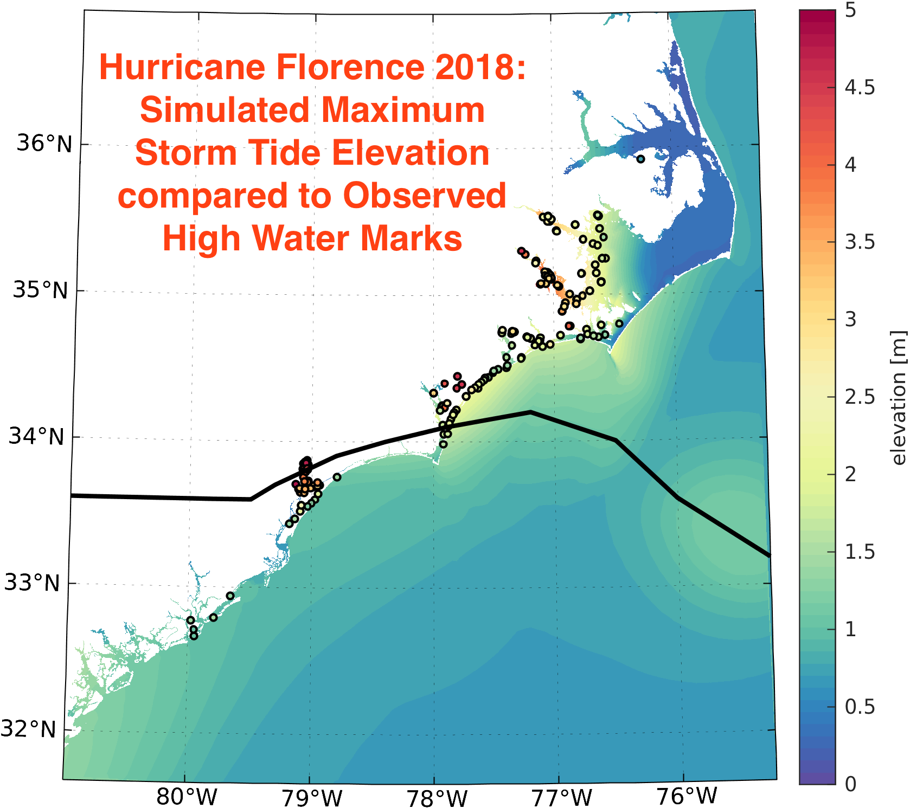
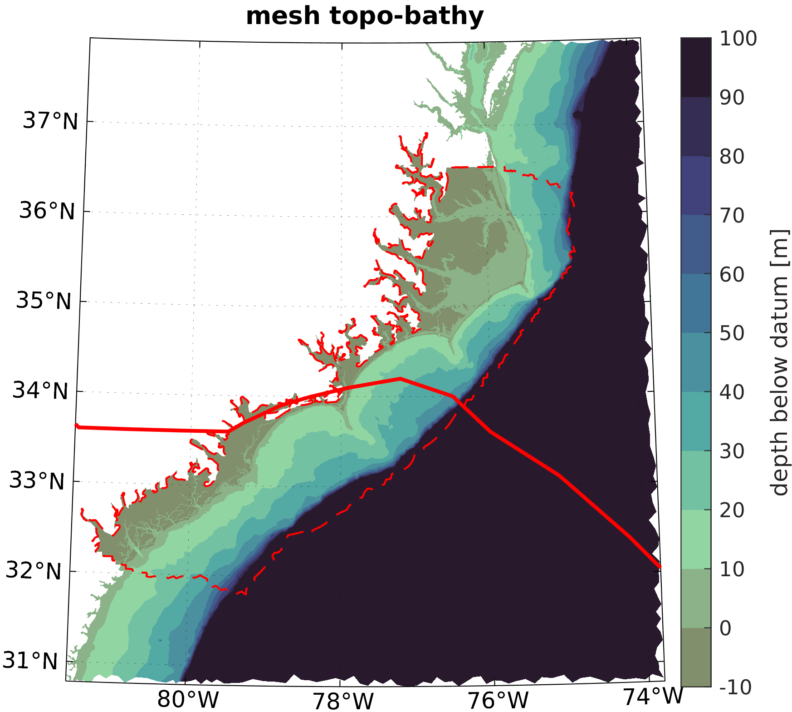
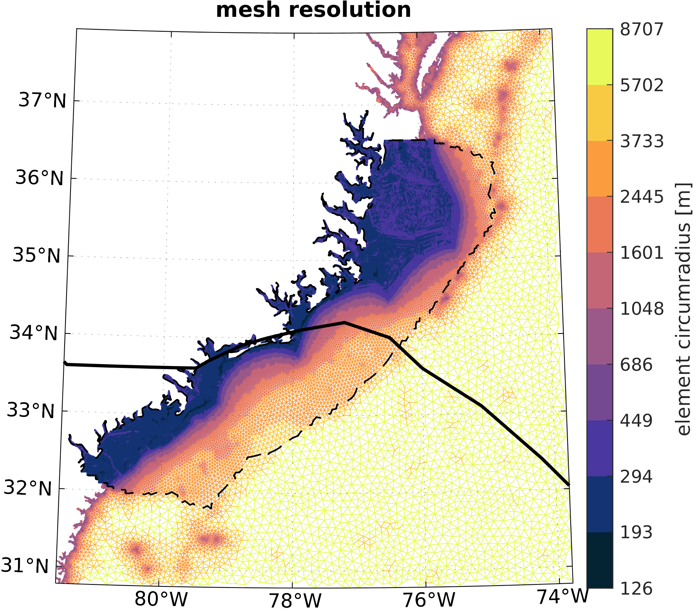

# Storm-Surge-Mesh-Subsetting

Table of contents
=================

<!--ts-->
   * [Storm-Surge-Mesh-Subsetting](#storm-surge-mesh-subsetting)
   * [Table of contents](#table-of-contents)
   * [Purpose](#purpose)
   * [Starting out](#starting-out)
   * [Requirements](#requirements)
   * [References](#references)
   * [Gallery](#gallery)
   * [Changelog](#changelog)
<!--te-->

Purpose
============
Subset a high-resolution mesh used for storm surge and coastal floods forecasts. The mesh subsetting is based on information such as a forecasted hurricane track. Subsetted meshes are seamlessly merged with a coarser mesh of the greater region.

Starting Out
============

1) Look at the `readmes` inside the `data/`, `mesh/`, and `exec/` directories to see what you might want to add to these directories in preparation. 

2) Modify `besttrack_subset_merge.py` for the hurricane (four examples included), wind swath isotach and reference depth used for subsetting. Also confirm fine and coarse mesh names. 

3) With python environment and MATLAB loaded, execute: `python besttrack_subset_merge.py`

4) Use `CoupledModelDriver` to set-up the simulation. 

Requirements
==============

### For mesh subset and merging
Python package:
- [adcircpy](https://github.com/noaa-ocs-modeling/adcircpy)

MATLAB toolbox:
- [OceanMesh2D](https://github.com/CHLNDDEV/OceanMesh2D)

### For simulation
Python package:
- [CoupledModelDriver](https://github.com/noaa-ocs-modeling/CoupledModelDriver)

FORTRAN code:
- [adcirc-cg](https://github.com/adcirc/adcirc-cg)

References
==============

```
OceanMesh2D:
- Roberts, K. J., Pringle, W. J., and Westerink, J. J., 2019.
      OceanMesh2D 1.0: MATLAB-based software for two-dimensional unstructured mesh generation in coastal ocean modeling,
      Geoscientific Model Development, 12, 1847-1868. https://doi.org/10.5194/gmd-12-1847-2019.

ADCIRC V55:
- Pringle, W. J., Wirasaet, D., Roberts, K. J., and Westerink, J. J., 2021.
      Global Storm Tide Modeling with ADCIRC v55: Unstructured Mesh Design and Performance,
      Geoscientific Model Development, 14, 1125-1145. https://doi.org/10.5194/gmd-14-1125-2021.
```

GALLERY:
=========

<p align="center">
   &nbsp &nbsp &nbsp &nbsp
   &nbsp &nbsp &nbsp &nbsp
   &nbsp &nbsp &nbsp &nbsp
</p>

Changelog
=========

The format is based on [Keep a Changelog](https://keepachangelog.com/en/1.0.0/)

## Unreleased

### Added

### Changed

### Fixed

### Deleted
